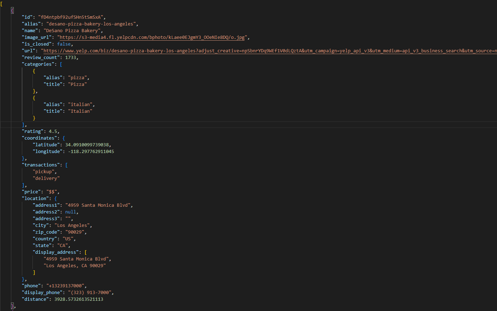
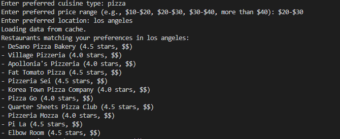

# SI 507: Final Project
# Yelp Restaurant Recommendation Tool

## Description
This tool offers targeted and personalized restaurant recommendations based on the users’ keywords and preferences. For example, when a user searches for a "Japanese restaurant in Los Angeles," the tool begins searching and provides various options, including online reviews, restaurant ratings, and cuisine recommendations to help users make informed decisions.

## Data Sources
### Yelp Fusion API
- **Data URL**: [Yelp Fusion API](https://www.yelp.com/developers/documentation/v3)
- **Documentation URL**: [Yelp Fusion Documentation](https://www.yelp.com/developers/documentation/v3/get_started)
- **Format**: JSON
- **Access Method**: Data is fetched using the `requests` library in Python.
- **Caching**: Data is cached in `yelp_data.json` to optimize performance.
- **Data Summary**:
  - **Records Available**: Extensive and dynamic, dependent on Yelp's database.
  - **Records Retrieved**: Up to 1000 records per user query.
  - **Description of Records**: Each record includes a restaurant's name, category, price level, location, rating, and Yelp URL.

## Data Structure
The application organizes restaurant data into a tree structure based on cuisine, price, and location. The structure is defined in Python and serialized into `yelp_data.json`.

## Function Descriptions
### cache_data(data, filename)
- **Purpose**: Saves fetched data into a file for caching.
- **Parameters**:
  - `data`: The data to be cached.
  - `filename`: The name of the file where data will be stored.
- **Returns**: None.

### load_cached_data(filename)
- **Purpose**: Loads data from a cache file if it exists.
- **Parameters**:
  - `filename`: The name of the file to load data from.
- **Returns**: Loaded data if the file exists, otherwise `None`.

### get_yelp_data(api_key, term, location, price, offset, limit)
- **Purpose**: Fetches restaurant data from the Yelp Fusion API.
- **Parameters**:
  - `api_key`: Your Yelp API key for authentication.
  - `term`: Search term (e.g., type of cuisine).
  - `location`: Location for the restaurant search.
  - `price`: Price range for filtering.
  - `offset`: Offset for pagination in API requests.
  - `limit`: Number of records to fetch per request.
- **Returns**: JSON response with restaurant data if successful, otherwise `None`.

### create_tree(data)
- **Purpose**: Organizes fetched restaurant data into a tree structure.
- **Parameters**:
  - `data`: Restaurant data to be organized.
- **Returns**: A tree structure where nodes represent cuisines, prices, and locations.

### get_user_preferences()
- **Purpose**: Prompts the user to enter their dining preferences.
- **Parameters**: None.
- **Returns**: A tuple containing user's cuisine type, price range, and location preferences.

### map_price_range_to_yelp_format(price_range)
- **Purpose**: Maps user-inputted price range to Yelp API's format.
- **Parameters**:
  - `price_range`: User-inputted price range.
- **Returns**: Corresponding price format for Yelp API.

### filter_restaurants(tree, cuisine, price_range, location)
- **Purpose**: Filters the restaurant data based on user preferences.
- **Parameters**:
  - `tree`: The tree structure containing restaurant data.
  - `cuisine`: Desired cuisine type.
  - `price_range`: Desired price range.
  - `location`: Desired location.
- **Returns**: A list of restaurants that match the given criteria.

### main()
- **Purpose**: Main function to run the application.
- **Operations**:
  - Handles user input for preferences.
  - Manages data retrieval and caching.
  - Calls other functions to process and filter data.
  - Displays the final list of recommended restaurants.
- **Returns**: None.

## Interaction and Presentation
### User Interaction
  - **Cuisine Preference**: Users can type in their preferred cuisine type (e.g., "new american", "Japanese").
  - **Price Range Preference**: Users are asked to specify their budget using predefined price ranges (e.g., "$10-$20", "$20-$30"). The tool maps these ranges to Yelp's price format.
  - **Location Preference**: Users input their desired location for restaurant recommendations (e.g., "west hollywood", "Los Angeles").
- **Processing User Input**:
  - Once preferences are entered, the tool processes these inputs to filter and retrieve relevant restaurant data from Yelp.
  - The filtered results are then presented in the command line, displaying a list of restaurants that match the user's criteria.
- **Output Information**:
  - For each recommended restaurant, the tool displays key information such as the restaurant's name, its Yelp rating, price level, and a link to the Yelp page.
  - This information assists users in making an informed choice about where to dine.

### Running the Program
1. **Installation**:
   - Ensure Python is installed on your system, along with the `requests` library.
2. **API Key Setup**:
   - Obtain a Yelp Fusion API key and insert it into the designated variable in the script.
3. **Execution**:
   - Run the script via a command-line interface.
4. **Input Preferences**:
   - Enter your cuisine, price, and location preferences when prompted by the program.
5. **View Recommendations**:
   - Review the list of restaurants provided based on your input criteria.

## Special Instructions
### API Key Confidentiality
- It is crucial to keep your Yelp API key confidential and not expose it in public repositories or share it with unauthorized users.

### Cache Management
- The application caches data in `yelp_data.json` for efficient performance. Delete or clear this file to refresh and retrieve new data from Yelp.

## Screenshots
- Screenshots here would show the input prompts and the resulting restaurant recommendations and the data structure from the Yelp Fusion API.

